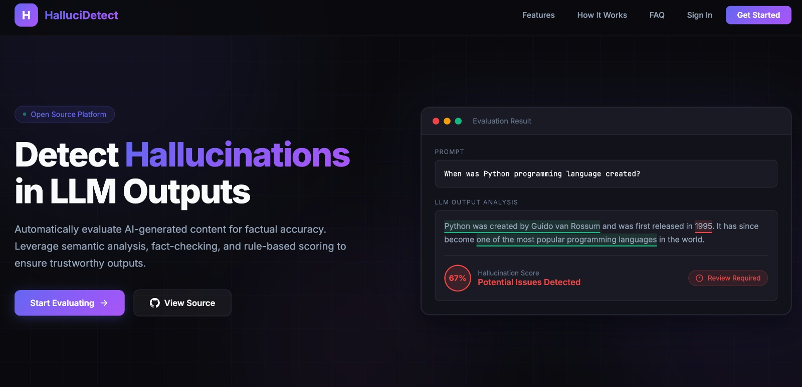
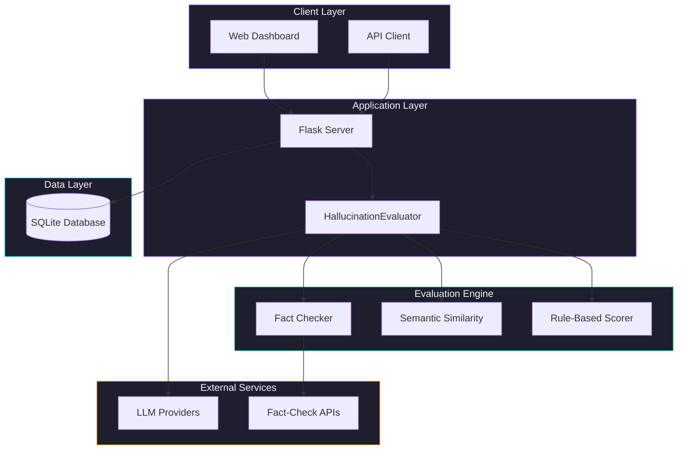
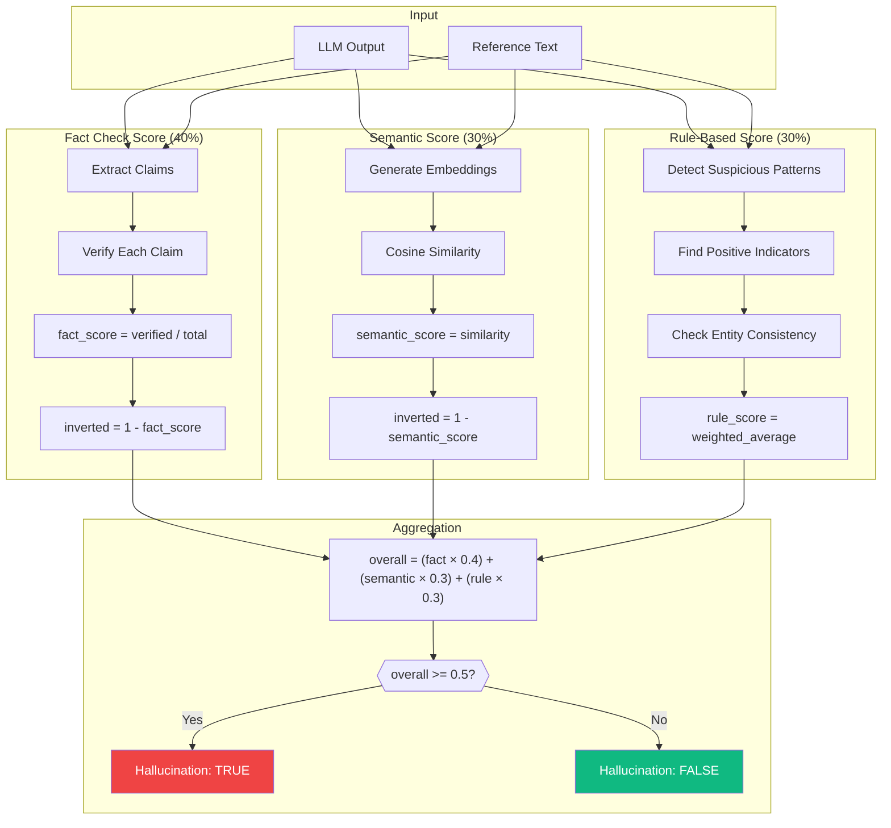
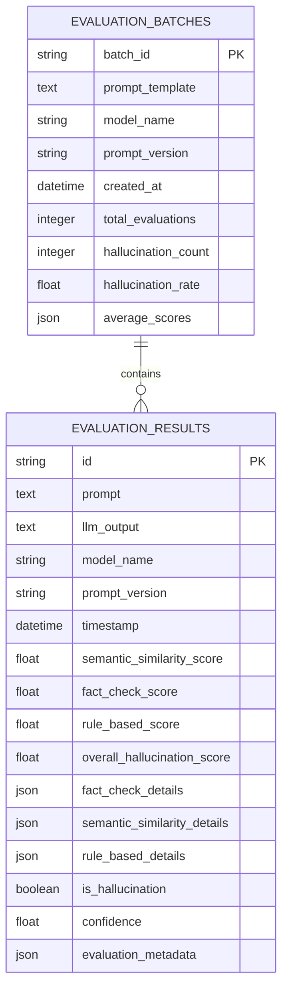
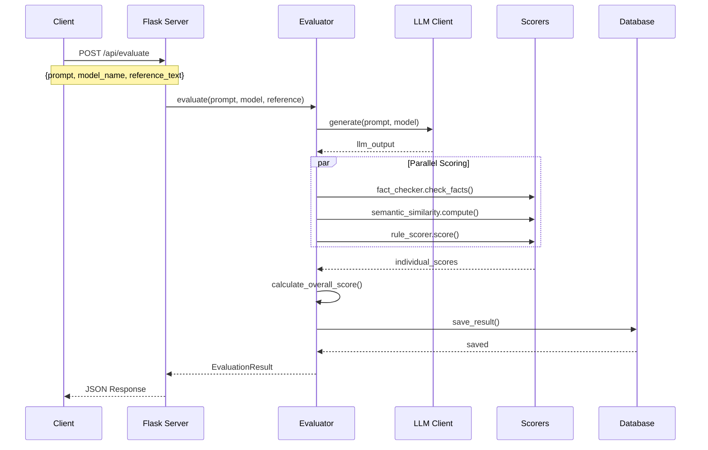
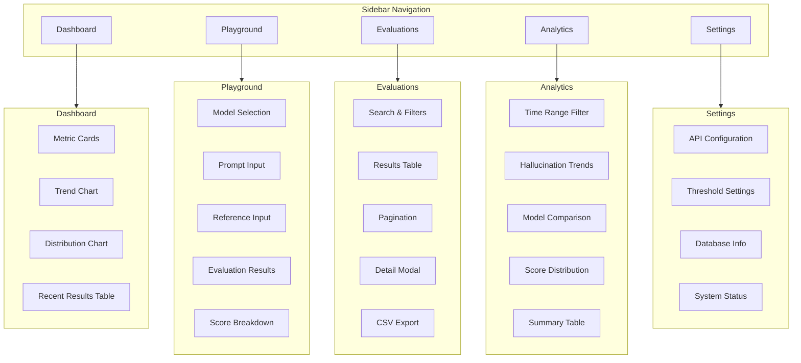
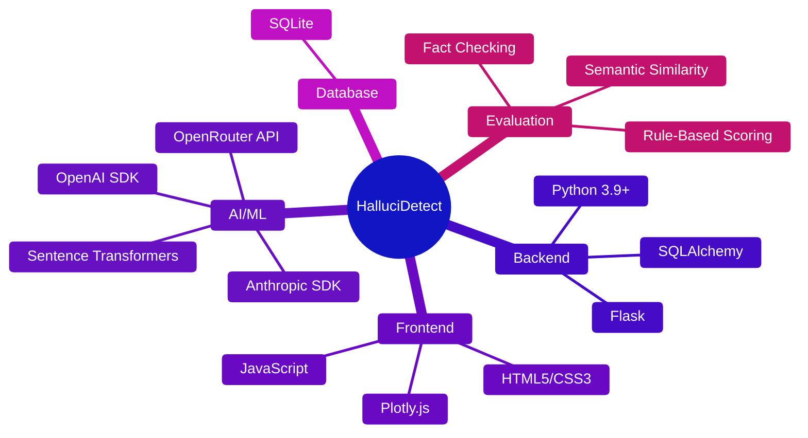

<h1 align="center">HalluciDetect</h1>

<p align="center">
  
</p>

<p align="center">
  <strong>Automated LLM Evaluation & Hallucination Detector</strong>
</p>

<p align="center">
  A comprehensive pipeline for automatically evaluating LLM outputs for hallucinations using fact-check APIs, semantic similarity, and rule-based scoring. Features a professional dashboard showing hallucination rate trends across different prompt versions and models.
</p>

---

## System Architecture



---

## Evaluation Pipeline Flow

```mermaid
flowchart LR
    A[Input Prompt] --> B[LLM Generation]
    B --> C[LLM Output]
    C --> D{Evaluation Engine}
    
    D --> E[Fact Checking]
    D --> F[Semantic Similarity]
    D --> G[Rule-Based Analysis]
    
    E --> H[Claim Extraction]
    H --> I[Claim Verification]
    I --> J[Fact Score]
    
    F --> K[Generate Embeddings]
    K --> L[Cosine Similarity]
    L --> M[Semantic Score]
    
    G --> N[Pattern Detection]
    N --> O[Entity Consistency]
    O --> P[Rule Score]
    
    J --> Q{Score Aggregator}
    M --> Q
    P --> Q
    
    Q --> R[Overall Hallucination Score]
    R --> S{Threshold Check}
    S -->|Score >= 0.5| T[Hallucination Detected]
    S -->|Score < 0.5| U[Verified Output]
    
    T --> V[(Store Result)]
    U --> V
    
    style A fill:#6366f1,stroke:#6366f1,color:#fff
    style C fill:#8b5cf6,stroke:#8b5cf6,color:#fff
    style R fill:#f59e0b,stroke:#f59e0b,color:#fff
    style T fill:#ef4444,stroke:#ef4444,color:#fff
    style U fill:#10b981,stroke:#10b981,color:#fff
```



---

## Component Architecture

```mermaid
flowchart TB
    subgraph app["app.py - Flask Application"]
        routes[Route Handlers]
        api[REST API Endpoints]
    end

    subgraph evaluator["evaluator.py - Main Pipeline"]
        eval_single[evaluate]
        eval_batch[evaluate_batch]
        score_calc[_calculate_overall_score]
    end

    subgraph llm["llm_client.py - LLM Integration"]
        openrouter[OpenRouter Client]
        openai[OpenAI Client]
        anthropic[Anthropic Client]
        model_map[Model Mapping]
    end

    subgraph fact["fact_checker.py"]
        extract[_extract_claims]
        check[_check_single_claim]
        api_check[_check_via_api]
    end

    subgraph semantic["semantic_similarity.py"]
        embeddings[SentenceTransformer]
        similarity[compute_similarity]
        batch_sim[compute_similarity_batch]
    end

    subgraph rules["rule_based_scorer.py"]
        patterns[Suspicious Patterns]
        indicators[Positive Indicators]
        consistency[Entity Consistency]
    end

    subgraph database["database.py"]
        save[save_result]
        query[get_results]
        trends[get_trends]
    end

    subgraph models["models.py"]
        EvalResult[EvaluationResult]
        EvalBatch[EvaluationBatch]
    end

    routes --> eval_single
    routes --> eval_batch
    api --> query

    eval_single --> openrouter
    eval_single --> extract
    eval_single --> similarity
    eval_single --> patterns
    eval_single --> score_calc
    eval_single --> save

    eval_batch --> eval_single
    
    save --> EvalResult
    query --> EvalResult
```



---

## Scoring Algorithm



---

## Database Schema



---

## API Request Flow



---

## UI Navigation Structure



---

## Tech Stack



---

## Features

- **Multi-method Evaluation**: Combines fact-checking, semantic similarity, and rule-based scoring
- **LLM Integration**: Supports OpenAI, Anthropic, and 100+ models via OpenRouter
- **Batch Evaluation**: Evaluate multiple test cases at once
- **Trend Analysis**: Track hallucination rates across prompt versions and models
- **Interactive Dashboard**: Professional dark-themed web interface
- **Database Storage**: SQLite database for persistent storage

## Project Structure

```
.
├── app.py                    # Flask web application with routes
├── config.py                 # Configuration settings
├── database.py               # Database models and CRUD operations
├── evaluator.py              # Main evaluation pipeline orchestrator
├── fact_checker.py           # Fact extraction and verification
├── llm_client.py             # Multi-provider LLM client
├── models.py                 # Data models (EvaluationResult, Batch)
├── rule_based_scorer.py      # Pattern and entity analysis
├── semantic_similarity.py    # Embedding-based similarity
├── requirements.txt          # Python dependencies
├── static/
│   └── css/style.css         # Dashboard styling
└── templates/
    ├── base.html             # Shared layout with sidebar
    ├── dashboard.html        # Overview with metrics
    ├── playground.html       # Single evaluation interface
    ├── evaluations.html      # Results history table
    ├── analytics.html        # Trend charts
    └── settings.html         # Configuration panel
```

## Installation

1. **Clone the repository**
```bash
git clone https://github.com/rishi02102017/Automated-LLM-Evaluation-and-Hallucination-Detector.git
cd Automated-LLM-Evaluation-and-Hallucination-Detector
```

2. **Create a virtual environment**
```bash
python -m venv venv
source venv/bin/activate  # On Windows: venv\Scripts\activate
```

3. **Install dependencies**
```bash
pip install -r requirements.txt
```

4. **Set up environment variables**

Create a `.env` file:
```env
OPENROUTER_API_KEY=your_openrouter_api_key
OPENAI_API_KEY=              # Optional
ANTHROPIC_API_KEY=           # Optional
DATABASE_URL=sqlite:///./evaluation_results.db
FLASK_ENV=development
FLASK_DEBUG=True
```

Get your OpenRouter API key at: https://openrouter.ai/keys

## Usage

### Running the Dashboard

```bash
python app.py
```

Open http://localhost:5001 in your browser.

### Python API

```python
from evaluator import HallucinationEvaluator

evaluator = HallucinationEvaluator()

# Single evaluation
result = evaluator.evaluate(
    prompt="What is the capital of France?",
    model_name="gpt-4o-mini",
    prompt_version="v1",
    reference_text="The capital of France is Paris."
)

print(f"Hallucination Score: {result.overall_hallucination_score}")
print(f"Is Hallucination: {result.is_hallucination}")
print(f"Confidence: {result.confidence}")
```

### REST API Endpoints

| Method | Endpoint | Description |
|--------|----------|-------------|
| POST | `/api/evaluate` | Evaluate a single prompt |
| POST | `/api/evaluate/batch` | Evaluate multiple test cases |
| GET | `/api/results` | Get evaluation results |
| GET | `/api/batches` | Get batch evaluations |
| GET | `/api/trends` | Get hallucination trends |
| GET | `/api/models` | Get available models |

## Evaluation Methods

### 1. Fact-Checking (40% weight)
- Extracts factual claims using pattern matching
- Verifies claims against reference text
- Supports external fact-check APIs

### 2. Semantic Similarity (30% weight)
- Uses sentence-transformers for embeddings
- Computes cosine similarity
- Threshold: 0.7 (configurable)

### 3. Rule-Based Scoring (30% weight)
- Detects suspicious patterns (overconfident statements)
- Identifies positive indicators (citations, specifics)
- Checks entity consistency (numbers, dates)

### Overall Score Formula
```
hallucination_score = (fact_inverted × 0.4) + (semantic_inverted × 0.3) + (rule_score × 0.3)
```

## Dashboard Pages

| Page | Features |
|------|----------|
| **Dashboard** | Metrics cards, trend charts, recent evaluations |
| **Playground** | Interactive evaluation with real-time results |
| **Evaluations** | Searchable history, filters, CSV export |
| **Analytics** | Model comparison, time-series trends |
| **Settings** | API config, thresholds, database info |

## Configuration

| Variable | Default | Description |
|----------|---------|-------------|
| `HALLUCINATION_SCORE_THRESHOLD` | 0.5 | Score above this = hallucination |
| `SEMANTIC_SIMILARITY_THRESHOLD` | 0.7 | Minimum similarity for alignment |
| `FACT_CHECK_CONFIDENCE_THRESHOLD` | 0.8 | Confidence to verify a claim |
| `DEFAULT_LLM_MODEL` | gpt-4o-mini | Default model for evaluation |

## Deployment

### Environment Variables for Production
```env
OPENROUTER_API_KEY=your_key
DATABASE_URL=sqlite:///./evaluation_results.db
FLASK_ENV=production
FLASK_DEBUG=False
```

### Platforms
- **Railway**: `railway up`
- **Render**: Connect GitHub repo
- **Fly.io**: `fly launch`
- **Heroku**: `git push heroku main`

## Contributing

This project demonstrates:
- LLM benchmarking and evaluation pipelines
- Prompt engineering with version tracking
- Python backend with Flask
- Professional dashboard development
- Data visualization with Plotly

---

## Author

**Jyotishman Das**

Built from scratch as a comprehensive LLM evaluation and hallucination detection platform.

- GitHub: [@rishi02102017](https://github.com/rishi02102017)

---

## License

MIT License

Copyright (c) 2024 Jyotishman Das

Permission is hereby granted, free of charge, to any person obtaining a copy
of this software and associated documentation files (the "Software"), to deal
in the Software without restriction, including without limitation the rights
to use, copy, modify, merge, publish, distribute, sublicense, and/or sell
copies of the Software, and to permit persons to whom the Software is
furnished to do so, subject to the following conditions:

**Attribution Requirement**: Any use, reproduction, or distribution of this 
software must include proper attribution to the original author (Jyotishman Das) 
with a link to the original repository.

The above copyright notice and this permission notice shall be included in all
copies or substantial portions of the Software.

THE SOFTWARE IS PROVIDED "AS IS", WITHOUT WARRANTY OF ANY KIND, EXPRESS OR
IMPLIED, INCLUDING BUT NOT LIMITED TO THE WARRANTIES OF MERCHANTABILITY,
FITNESS FOR A PARTICULAR PURPOSE AND NONINFRINGEMENT. IN NO EVENT SHALL THE
AUTHORS OR COPYRIGHT HOLDERS BE LIABLE FOR ANY CLAIM, DAMAGES OR OTHER
LIABILITY, WHETHER IN AN ACTION OF CONTRACT, TORT OR OTHERWISE, ARISING FROM,
OUT OF OR IN CONNECTION WITH THE SOFTWARE OR THE USE OR OTHER DEALINGS IN THE
SOFTWARE.
